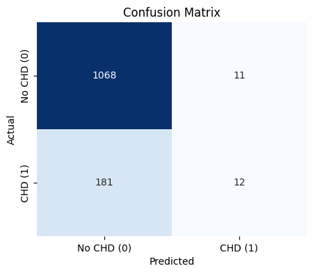
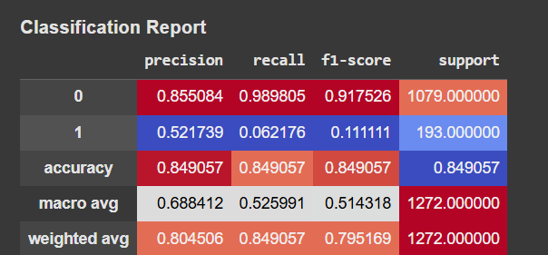
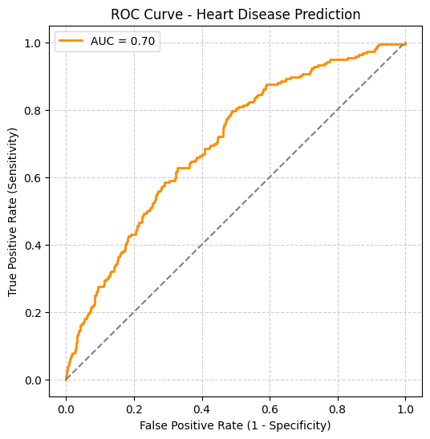

# Assignment-1
 Logistic Regression - Heart Disease Prediction

## Project Overview
This project uses **Logistic Regression** to predict the 10-year risk of Coronary Heart Disease (CHD) using the **Framingham Heart Study dataset**.  
It demonstrates data preprocessing, feature selection, model training, evaluation, and interpretation of results.

---

##  Dataset
- Source: [Kaggle - Framingham Heart Study Dataset](https://www.kaggle.com/datasets/amanajmera1/framingham-heart-study-dataset)
- Records: ~4,000
- Attributes: 15 demographic, behavioral, and medical risk factors

---

##  Workflow
1. Data Preprocessing (handling missing values, scaling features)  
2. Train-Test Split (70%-30%)  
3. Logistic Regression Model Training  
4. Evaluation using:
   - Accuracy
   - Confusion Matrix
   - Precision, Recall, F1-Score
   - ROC Curve & AUC Score  

---

##  Results
- Accuracy: ~85%  
- ROC-AUC: ~0.70  
- Model is **more specific than sensitive**  
- Key risk factors: **Sex (Male), Age, Cigarettes per Day, Systolic Blood Pressure**  

---

### Confusion Matrix

---

### Classification Report

---

### ROC Curve

---

